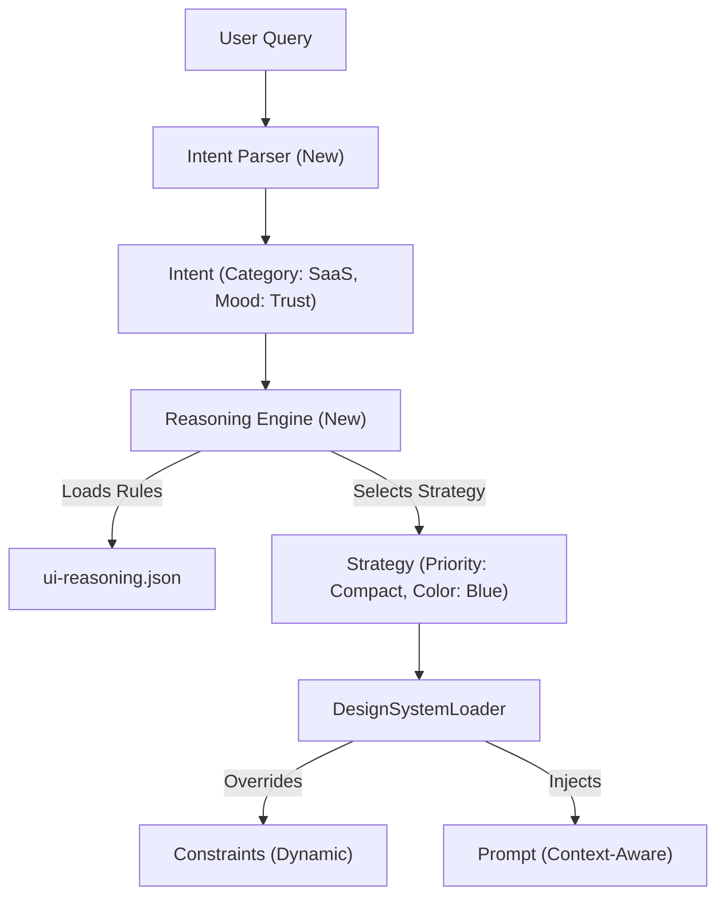

# 架构综合与复制路径提议 (Replication Path Proposal)

## 1. 现状与差距分析 (Gap Analysis)

| 组件 | Current State ([DesignSystemLoader](file:///Users/daxiaoxiao/Projects/figma%20gen%20plugin/figma-ai-generator/src/services/designSystemLoader.ts#248-413)) | Target State (UI Pro Max Inspired) | 差距 (Gap) |
| :--- | :--- | :--- | :--- |
| **触发器** | `SystemID` (静态，如 "shadcn") | `User Intent` (动态，如 "SaaS Dashboard") | 缺少“意图”解析和传递机制。 |
| **配置** | 静态 JSON 文件 ([constraints.json](file:///Users/daxiaoxiao/Projects/figma%20gen%20plugin/figma-ai-generator/src/config/systems/shadcn/constraints.json)) | 动态策略 (`Strategy` + `Assets`) | 配置是硬编码的，无法根据意图自动调整（例如 SaaS 需要更紧凑的间距）。 |
| **Prompt** | 静态字符串片段 (`PROMPT_SNIPPETS`) | 动态检索的指令集 | Prompt 无法根据具体的业务场景（如 Fintech）注入特定的颜色或布局规则。 |

## 2. 目标架构设计 (Target Architecture)

我们需要在现有的 [DesignSystemLoader](file:///Users/daxiaoxiao/Projects/figma%20gen%20plugin/figma-ai-generator/src/services/designSystemLoader.ts#248-413) 之上引入一个轻量级的 **"Reasoning Layer" (推理层)**。



## 3. 详细复制路径 (Implementation Plan)

### 第一步：定义意图接口 (Define Intent Interface)
在 [src/services/designSystemLoader.ts](file:///Users/daxiaoxiao/Projects/figma%20gen%20plugin/figma-ai-generator/src/services/designSystemLoader.ts) 中引入 `DesignIntent` 类型，不仅仅是 [SystemId](file:///Users/daxiaoxiao/Projects/figma%20gen%20plugin/figma-ai-generator/src/services/designSystemLoader.ts#353-359)。

```typescript
interface DesignIntent {
  category: string; // e.g., "SaaS", "E-commerce"
  mood: string;     // e.g., "Trustworthy", "Playful"
  density: 'compact' | 'comfortable' | 'spacious';
}
```

### 第二步：移植推理数据 (Migrate Reasoning Data)
将 [ui-reasoning.csv](file:///Users/daxiaoxiao/Projects/figma%20gen%20plugin/ui-ux-pro-max-skill/skills/ui-ux-pro-max/data/ui-reasoning.csv) 的核心逻辑转换为 `src/config/reasoning/strategies.json`。我们不需要完整的 BM25 引擎，一个简单的内存映射器即可。

### 第三步：增强 DesignSystemLoader (Enhance Loader)
修改 [getPromptSnippet](file:///Users/daxiaoxiao/Projects/figma%20gen%20plugin/figma-ai-generator/src/services/designSystemLoader.ts#180-182) 和 [getConstraint](file:///Users/daxiaoxiao/Projects/figma%20gen%20plugin/figma-ai-generator/src/services/designSystemLoader.ts#167-169) 方法，使它们接受 `DesignIntent` 作为上下文。

- **Prompt 增强**: 如果意图是 "Fintech"，自动注入 "Use Blue/Grey palette, prioritize extensive data tables"。
- **约束增强**: 如果意图是 "Dashboard"，自动调整 `paddingMin` 为更小的值。

## 4. 推荐行动 (Recommendation)

建议立即启动 **"Phase 3: Reasoning Layer Integration"**：
1.  创建一个新的目录 `src/features/reasoning/`。
2.  将 [ui-reasoning.csv](file:///Users/daxiaoxiao/Projects/figma%20gen%20plugin/ui-ux-pro-max-skill/skills/ui-ux-pro-max/data/ui-reasoning.csv) 的数据清洗并转换为 JSON 常量。
3.  在 [DesignSystemLoader](file:///Users/daxiaoxiao/Projects/figma%20gen%20plugin/figma-ai-generator/src/services/designSystemLoader.ts#248-413) 中添加一个实验性的 `resolveIntent(query: string)` 方法。

此方案将使我们无需重写整个引擎即可获得 "Pro Max" 80% 的智能特性，且保持了代码库的整洁（SSOT）。
