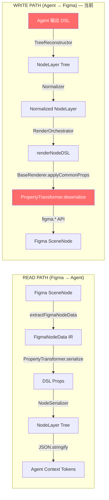
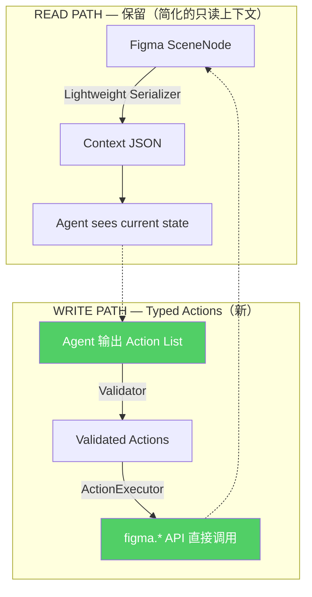

# 架构：当前 DSL Pipeline vs Typed Actions

> **核心命题**：DSL 退为只读上下文层，写入协议改用 Typed Actions（直接映射 figma.* API），消除 6 层翻译链。

## 1. 全局架构图



**目标架构**：



---

## 2. 当前写入路径（6 层翻译链）

| 层 | 文件 | 行数 | 作用 | 引入的问题 |
|---|------|------|------|-----------|
| ① Agent 输出 | — | — | 生成 DSL flat list | Agent 必须学习自定义 DSL 格式 |
| ② TreeReconstructor | `treeReconstructor.ts` | 134 | flat list → tree | 孤儿节点恢复、wrapper 创建 |
| ③ Normalizer | `Normalizer.ts` | 243 | 修正 LLM 常见错误 | 别名解析、enum 静默修正 |
| ④ RenderOrchestrator | `RenderOrchestrator.ts` | 201 | 资源预热+入口 | warmup + positioning |
| ⑤ BaseRenderer | `baseRenderer.ts` | 441 | 通用属性应用 | `PropertyTransformer.deserialize()` 反向映射 |
| ⑥ Type-specific Renderer | `frame/text/vector...` | ~800 | 创建节点 + 特殊属性 | 每种类型 200-400 行 |

**合计：~1450 行翻译/适配代码**

---

## 3. 翻译损耗的关键证据

### 3.1 属性映射分析

40+ 个属性中仅 4 个需要 key 翻译：

```diff
# DSL Key ≠ Figma Key（需要翻译）
- gap         → figmaKey: 'itemSpacing'
- fontWeight  → virtual (maps to fontName.style)
- fontFamily  → virtual (maps to fontName.family)
- textAlign   → figmaKey: 'textAlignHorizontal'

# DSL Key = Figma Key（不需要翻译，占 90%+）
+ layoutMode, cornerRadius, opacity, width, height, x, y
+ paddingTop/Right/Bottom/Left, layoutSizingHorizontal/Vertical
+ primaryAxisAlignItems, counterAxisAlignItems, fills, strokes...
```

> 为 4 个属性维护了 PropertyTransformer（250行）+ PROP_METADATA（88行）。

### 3.2 TreeReconstructor — 不必要的抽象

```json
// Agent 输出 flat list
[
  { "id": "root", "parent": null, "type": "FRAME", "props": {...} },
  { "id": "child1", "parent": "root", "type": "TEXT", "props": {...} }
]
// → TreeReconstructor 变 tree → Renderer 又遍历 tree 递归创建

// Typed Actions 直接说：
[
  { "action": "createFrame", "tempId": "root", "props": { "layoutMode": "VERTICAL" } },
  { "action": "createText", "parentId": "root", "props": { "characters": "Hello" } }
]
// → 执行器按顺序执行，无需 tree 重建
```

### 3.3 Normalizer — 修正 LLM 的 DSL 错误

主要工作：
- 别名解析：`spacing → gap`, `content → characters`, `background → fills`
- 约束修正：HUG 但没有 layoutMode → 强制加 layoutMode
- Enum 静默修正：`"left" → "LEFT"`

**如果 Agent 直接输出 Figma 属性名，别名问题消失。**

### 3.4 PropertyTransformer.deserialize — 最核心的翻译损耗

```typescript
// 现在的流程：
// Agent: { gap: 16 }
// → PROP_METADATA['gap'].figmaKey = 'itemSpacing'
// → PropertyTransformer.deserialize(16, 'gap') → 16
// → node['itemSpacing'] = 16

// 如果直接映射：
// Agent: { itemSpacing: 16 }
// → node.itemSpacing = 16
```

---

## 4. Action Types 定义

```typescript
type FigmaAction =
  | CreateFrameAction
  | CreateTextAction
  | CreateShapeAction
  | CreateInstanceAction
  | UpdatePropsAction
  | DeleteNodeAction
  | MoveNodeAction;

interface CreateFrameAction {
  action: 'createFrame';
  tempId?: string;               // 临时 ID，后续 action 可引用
  parentId?: string;             // 真实 Figma ID 或前序 action 的 tempId
  props: {
    name?: string;
    layoutMode?: 'HORIZONTAL' | 'VERTICAL' | 'NONE';
    itemSpacing?: number;        // Figma 原生名
    paddingTop?: number;
    paddingRight?: number;
    paddingBottom?: number;
    paddingLeft?: number;
    layoutSizingHorizontal?: 'FIXED' | 'HUG' | 'FILL';
    layoutSizingVertical?: 'FIXED' | 'HUG' | 'FILL';
    width?: number;
    height?: number;
    fills?: string[];            // 简化：hex 数组
    cornerRadius?: number;
    opacity?: number;
    effects?: Effect[];
  };
}

interface CreateTextAction {
  action: 'createText';
  tempId?: string;
  parentId?: string;
  props: {
    characters: string;
    fontSize?: number;
    fontFamily?: string;         // → executor 组合为 fontName.family
    fontWeight?: string;         // → executor 组合为 fontName.style
    fills?: string[];
    textAlignHorizontal?: string;
    lineHeight?: number;
  };
}

interface CreateInstanceAction {
  action: 'createInstance';
  tempId?: string;
  parentId?: string;
  source: {
    componentKey?: string;       // 推荐：跨文档稳定 key
    nodeId?: string;             // 可选：当前文档内组件节点 ID
  };
  props?: {
    name?: string;
    width?: number;
    height?: number;
    x?: number;
    y?: number;
  };
}

interface UpdatePropsAction {
  action: 'updateProps';
  nodeId: string;                // 真实 Figma ID
  props: Record<string, any>;   // Figma 属性名
}

interface CreateInstanceAction {
  action: 'createInstance';
  tempId?: string;
  parentId?: string;
  componentKey?: string;          // Figma component key
  componentNodeId?: string;       // or direct node ID of the component
  props?: {
    name?: string;
    x?: number;
    y?: number;
    width?: number;
    height?: number;
  };
}

interface SwapInstanceAction {
  action: 'swapInstance';
  nodeId: string;                 // 实例节点 ID
  newComponentKey?: string;
  newComponentNodeId?: string;
}

interface DeleteNodeAction {
  action: 'delete';
  nodeId: string;
}
```

---

## 5. ActionExecutor 设计

```typescript
class ActionExecutor {
  async execute(
    actions: FigmaAction[],
    options: { onError?: 'skip-dependents' | 'abort' } = {}
  ): Promise<ExecutionResult> {
    const tempIdMap = new Map<string, string>(); // tempId → realFigmaId
    const results: ActionResult[] = [];
    const onError = options.onError || 'skip-dependents';
    const rollbackStack: string[] = [];

    for (const action of actions) {
      const result = await this.executeOne(action, tempIdMap);
      results.push(result);
      if (action.tempId && result.nodeId) {
        tempIdMap.set(action.tempId, result.nodeId);
        rollbackStack.push(result.nodeId);
      }
      if (!result.success && onError === 'abort') {
        break;
      }
    }

    return {
      results,
      idMap: Object.fromEntries(tempIdMap),
      rollback: { attempted: rollbackStack.length, removed: 0, failed: [] }
    };
  }

  private async executeOne(action: FigmaAction, idMap: Map<string, string>): Promise<ActionResult> {
    switch (action.action) {
      case 'createFrame': {
        const frame = figma.createFrame();
        const parent = this.resolveParent(action.parentId, idMap);
        if (parent) parent.appendChild(frame);
        this.applyProps(frame, action.props);  // 直接设属性,无需 PropertyTransformer
        return { success: true, nodeId: frame.id };
      }
      case 'createText': {
        const text = figma.createText();
        const parent = this.resolveParent(action.parentId, idMap);
        if (parent) parent.appendChild(text);
        await this.applyTextProps(text, action.props); // font loading + props
        return { success: true, nodeId: text.id };
      }
      case 'createInstance': {
        const master = await this.resolveComponent(action.source);
        if (!master) return { success: false, error: 'Component source not found' };
        const instance = master.createInstance();
        const parent = this.resolveParent(action.parentId, idMap);
        if (parent) parent.appendChild(instance);
        if (action.props) this.applyProps(instance, action.props);
        return { success: true, nodeId: instance.id };
      }
      case 'updateProps': {
        const node = await figma.getNodeByIdAsync(action.nodeId);
        if (!node) return { success: false, error: 'Node not found' };
        this.applyProps(node as SceneNode, action.props);
        return { success: true, nodeId: action.nodeId };
      }
    }
  }

  /** 危险属性黑名单 — 禁止通过 applyProps 修改 */
  private static readonly DENIED_PROPS = new Set(['id', 'parent', 'removed', 'type']);

  /** 直接映射属性名到 Figma API（含安全校验） */
  private applyProps(node: SceneNode, props: Record<string, any>) {
    for (const [key, value] of Object.entries(props)) {
      if (ActionExecutor.DENIED_PROPS.has(key)) {
        throw new Error(`Cannot set denied property: ${key}`);
      }
      if (key === 'fills' && Array.isArray(value)) {
        (node as any).fills = value.map(hex => createSolidPaint(hex));
      } else if (key in node) {
        // 布局约束校验（移植自 validatePreconditions）
        this.validateLayoutConstraints(node, key, value);
        (node as any)[key] = value;
      }
    }
  }

  /** 布局约束校验 — 移植自 toolCallHandler.validatePreconditions */
  private validateLayoutConstraints(node: SceneNode, key: string, value: any) {
    // 例：设 itemSpacing 但没有 layoutMode → 报错
    if (key === 'itemSpacing' && 'layoutMode' in node && (node as any).layoutMode === 'NONE') {
      throw new Error('Cannot set itemSpacing on a node without layoutMode');
    }
  }

  // --- Transaction & Rollback ---

  /**
   * 事务语义（移植自 BatchExecutor）：
   * - dependsOn: 声明 action 间依赖关系
   * - onError: 'skip-dependents' | 'abort'
   * - 失败时返回 rollback summary
   */
  async executeWithTransaction(
    actions: (FigmaAction & { dependsOn?: string[]; onError?: 'skip-dependents' | 'abort' })[]
  ): Promise<ExecutionResult> {
    // 拓扑排序 + 依赖解析
    // 部分失败时根据 onError 策略决定跳过依赖项或中止
    // 返回 rollback summary
    // TODO: 实现细节参考 batchExecutor.ts 现有逻辑
    return this.execute(actions); // placeholder
  }
}
```

事务语义（必须保留现有能力）：

- action 支持 `dependsOn`（显式依赖）
- 执行选项支持 `onError: 'skip-dependents' | 'abort'`
- 返回包含 rollback 摘要（attempted/removed/failed）

---

## 6. 属性约定

Agent 在 Action 中使用 **Figma 原生属性名**，除了以下便捷字段：
- `fills: string[]` — hex 数组，executor 内部转 `Paint[]`
- `fontFamily: string` — executor 内部组合成 `{ family, style }`
- `fontWeight: string` — 同上
- `padding: number` — 展开为 4 个 padding 字段

这些便捷字段的翻译在 **ActionExecutor 内部一次性完成**，不经过外部翻译层。

---

## 7. 可以移除的代码

| 模块 | 行数 | 命运 |
|------|------|------|
| TreeReconstructor | 134 | ❌ 删除 — actions 有序，不需 tree 重建 |
| PropertyTransformer.deserialize | ~60 | ❌ 删除 — Agent 直接用 Figma 属性名 |
| PropertyTransformer.isEqual | ~50 | ✅ 保留 — read path `serializeWithCompression()` 依赖（joint decision #4） |
| PropertyTransformer.serialize | ~60 | ✅ 保留 — 仅用于 read path |
| Normalizer (大部分) | ~200 | ❌ 删除 |
| BaseRenderer 子类 | ~800 | ❌ 删除 — 替换为 ActionExecutor |
| Renderer Factory | ~150 | ❌ 删除 |
| **合计可移除** | **~1450** | |

## 8. 保留什么

| 模块 | 用途 |
|------|------|
| NodeSerializer (精简版) | Read path：给 Agent 展示当前画布状态 |
| PropertyTransformer.serialize | Read path：Figma → 可读属性 |
| PROP_METADATA (部分) | Read path：知道哪些属性值得展示 |
| fontBus | ActionExecutor 需要加载字体 |
| figmaVariableCache | ActionExecutor 需要解析变量 |

---

## 9. Token 效率预测

**同一个 "创建一个输入框" 任务**：

| | DSL 方式 | Typed Actions |
|--|---------|---------------|
| Agent 输出 tokens | ~85 | ~90 |
| 翻译步骤 | 6 层 | 1 层 |
| 潜在错误点 | TreeRecon → Normalizer → PropertyTransformer | Validator → Executor |

输出 tokens 基本持平，但翻译步骤从 6 层降到 1 层，错误面大幅收窄。

**Read path 的节省更显著**：Agent 不再需要读回完整 DSL 来"对齐输出格式"——直接用 `updateProps` 修改。
