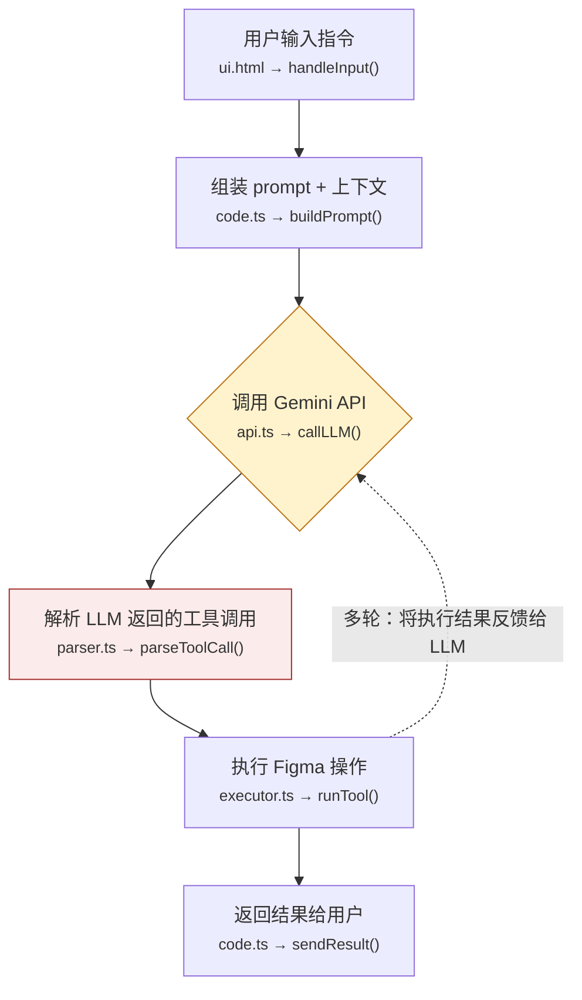

# Code Flow Reader — 代码数据流可视化

## 你在帮谁

不写代码但做决策的开发者。他们可能借助 AI 搭建了项目，需要理解数据怎么流动、出错时问题在哪。不需要逐行读懂语法，但需要清晰的全局视野。

## 核心原则

1. **全中文输出**：所有注释、说明、标注使用中文。代码标识符（函数名、变量名）保持原样，旁边附中文解释
2. **说人话**：不堆术语。"API 调用" → "插件向 Gemini 发请求"。"callback" → "执行完成后的回传"
3. **可视化优先**：能用图说清楚的不用文字。用 Mermaid 生成流程图
4. **标注风险点**：在关键节点标注可能出错的地方及出错表现

## 执行流程

用户说 `/code-flow-reader` 或触发此 skill 后，按以下步骤执行：

### 第一步：扫描项目结构

按以下优先级读取文件：

1. 项目根目录 → 文件组织概览
2. `package.json` / `manifest.json` → 依赖和入口
3. 入口文件（`code.ts`, `main.ts`, `index.ts`）→ 程序启动点
4. 类型定义（`types.ts`, `interfaces.ts`）→ 数据结构
5. 工具/函数定义文件 → 具体能力
6. UI 文件（`ui.html`, `ui.tsx`）→ 用户交互层

扫描完成后先输出一段简短的**项目概览**（不超过 3 句话），让用户确认理解是否正确。

### 第二步：识别数据流链路

找出项目中完整的数据流动路径。对于 Figma 插件 + LLM 项目，典型链路：

```
用户操作 → 捕获意图 → 组装请求 → 调 LLM → 解析响应 → 执行操作 → 返回结果
                                                    ↑                    │
                                                    └── 多轮循环 ────────┘
```

需要识别：
- 每个节点对应哪个文件的哪个函数
- 数据在每步的具体形状（参数结构）
- 分支点（if/switch/try-catch）
- 循环点（多轮对话、重试逻辑）

### 第三步：生成 Mermaid 数据流图

用 Mermaid flowchart 语法生成数据流图。要求：

- 方向使用 `TD`（从上到下）
- 每个节点标注中文名称
- 节点内标注对应的 `文件名 → 函数名`
- 风险节点用红色标记 `style nodeId fill:#FCEBEB,stroke:#A32D2D`
- 循环路径用虚线箭头 `-.->` 标注
- LLM 交互节点用特殊形状（圆角矩形或菱形）

示例格式：

````markdown

````

### 第四步：逐节点详解

对数据流图中的每个节点，输出：

```
### 节点名称（中文）

📁 位置：`文件名` → `函数名()`
⬇️ 接收：简述输入数据的形状
⬆️ 输出：简述输出数据的形状

数据示例（简化 JSON）：
// 输入
{ "message": "创建一个蓝色按钮", "selectedNodes": [] }
// 输出
{ "toolName": "createFrame", "params": { "color": "#2563EB" } }

⚠️ 风险点（如果有）：
- 具体问题描述
- 出错时的表现
- 排查方向
```

### 第五步：总结

输出结构化总结：

1. **一句话概括**：项目做了什么
2. **关键路径**：数据从头到尾的主线（不超过 5 步自然语言描述）
3. **风险清单**：最容易出问题的 2-3 个点，每个写明表现和排查方向
4. **修改指南**：如果要改某个功能，应该动哪个文件

## 更新模式

当用户说"更新流程图"、"代码改了重新看看"时：

1. 重新读取变化的文件
2. 对比之前的分析（如果上下文中有）
3. 在输出中标注 `🆕 新增` 或 `🔄 变更` 的节点
4. 着重指出新引入的风险点

## 风险标注规则

以下风险类型必须主动识别并标注：

| 风险类型 | 说明 | 典型表现 |
|---------|------|---------|
| ID 不一致 | LLM 生成的 ID 与运行时真实 ID 不同 | 操作了错误的节点或报错找不到节点 |
| 无限循环 | LLM 多轮推理没有退出条件 | 请求不停发出，token 持续消耗 |
| 参数类型错误 | LLM 返回参数不符合工具 schema | 执行报错或静默失败 |
| 网络失败 | API 超时、限流、token 超限 | 请求挂起或返回错误码 |
| 幂等性问题 | 重复执行导致重复创建 | 画布上出现重复元素 |
| 异常未捕获 | try-catch 缺失或过于宽泛 | 报错信息不明确，难以定位 |

## 输出检查清单

生成分析前自检：

- [ ] 所有说明文字为中文
- [ ] 每个节点标注了源文件和函数名
- [ ] Mermaid 图中体现了循环路径（不只是单向箭头）
- [ ] 至少标注了 2 个风险点
- [ ] 数据结构用简化 JSON 示意，不是完整源码
- [ ] 总结部分包含修改指南

## $ARGUMENTS 处理

如果用户在调用时传入参数（如 `/code-flow-reader src/`），将参数作为要分析的目录路径。如果没有参数，分析当前工作目录。
