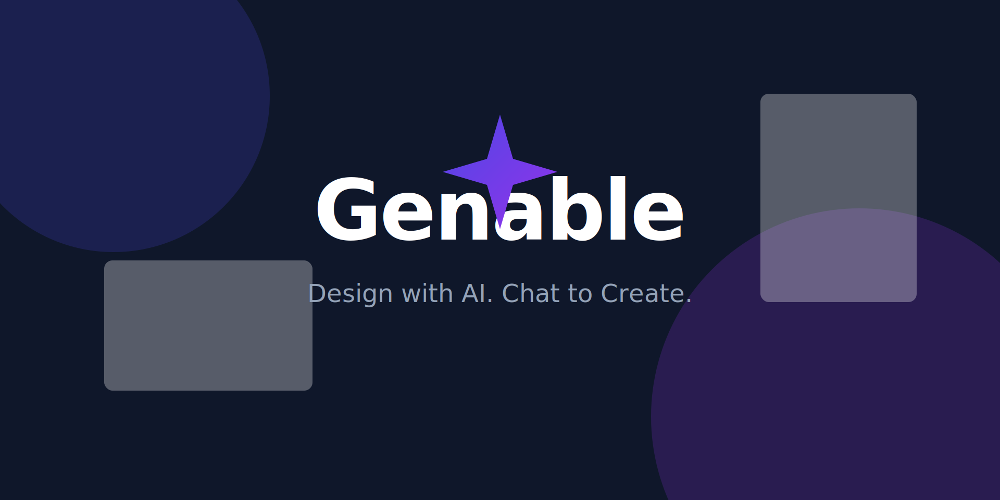
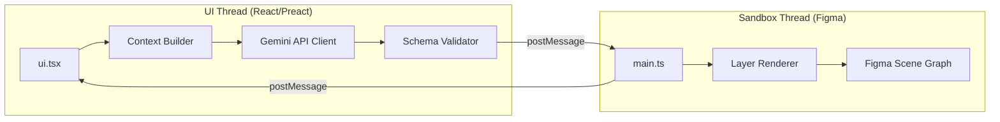

# Figma AI Generator (Genable)



**Figma AI Generator** is an advanced Figma plugin that leverages Google's Gemini AI to generate semantically correct, editable UI components from natural language prompts. It features a dual-thread architecture and a "Pure Trust" sanitization engine to ensure high-fidelity design reproduction.

---

## 🌟 Key Features (v1.0.0)

-   **Intelligent Intent Recognition:** Uses dynamic pattern matching to understand user intent (e.g., "Create a dashboard" vs. "Add a button") rather than heuristic guessing.
-   **Pure Trust Engine:** Respects LLM design intent by preserving stylistic choices (strokes, fills) on generic frames, avoiding aggressive over-sanitization.
-   **Unified Property Mapping:** Standardized DSL layer ensures consistent property translation between the Gemini LLM and Figma's SceneGraph.
-   **Knowledge-Driven Generation:** RAG-enhanced generation using a curated component knowledge base (`src/knowledge`).
-   **Native Figma Quality:** Outputs production-ready Auto Layout frames, responsive text, and vector networks.

---

## 🏗 Architecture

This plugin adopts Figma's **dual-thread architecture** to ensure performance and security:



| Thread | Responsibility | Access |
|--------|----------------|--------|
| **UI Thread** | Prompt processing, LLM communication, State management | Network, LocalStorage |
| **Sandbox Thread** | Node creation, Layout engine, Property application | Figma Document API |

---

## 🚀 Usage

1.  **Install**: Load the plugin manifest in Figma Desktop (`Plugins > Development > Import manifest...`).
2.  **Configure**: Enter your Gemini API Key (stored locally).
3.  **Generate**:
    -   *Simple*: "A primary button with an icon."
    -   *Complex*: "A dark-mode analytics dashboard with a sidebar, header, and data grid."
4.  **Refine**: The plugin uses context from your current selection to match styles.

---

## 🛠 Development

### Prerequisites
- Node.js v18+
- Figma Desktop App

### Setup
```bash
git clone <repo-url>
npm install
npm run build
```

### Folder Structure
- `src/main.ts`: Sandbox thread entry point.
- `src/ui.tsx`: UI thread entry point.
- `src/engine/`: Core logic for layout, rendering, and LLM client.
- `src/knowledge/`: Component patterns and anatomy registry.

### Releasing
Run the standard build command to generate the `dist/` artifacts:
```bash
npm run build
```

---

## 🔒 Security & Privacy

-   **Local Key Storage**: API keys are stored in `localStorage` and never transmitted to our servers.
-   **Direct Communication**: The plugin communicates directly with Google's Generative AI API.

---

## 📜 License

[MIT](./LICENSE)