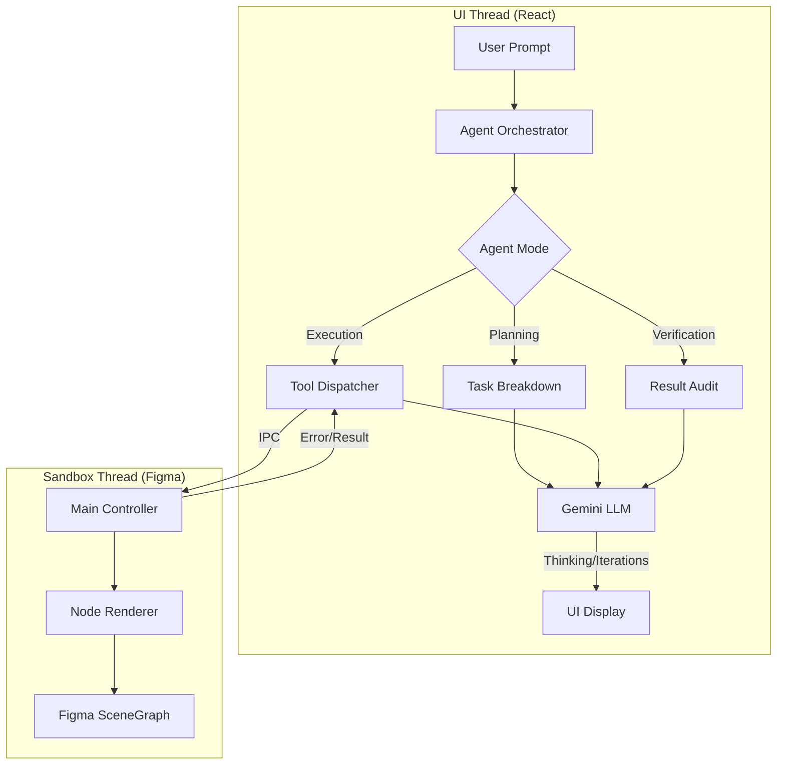

# Figma AI Generator (Genable)


**Figma AI Generator** is an advanced Figma plugin that leverages Google's Gemini AI to generate semantically correct, editable UI components from natural language prompts. It features a dual-thread architecture and a "Pure Trust" sanitization engine to ensure high-fidelity design reproduction.

---

## 🌟 Key Features (v1.0.0)

-   **Agentic Orchestration:** Moves beyond single-shot generation to a multi-phase agent loop (Planning → Execution → Verification).
-   **Transparent Reasoning:** Real-time visualization of the agent's "thinking" process through iteration cards.
-   **Pure Trust Engine:** Respects LLM design intent by preserving stylistic choices (strokes, fills) on generic frames.
-   **Remote Logging System:** Custom WebSocket-based logging server for real-time debugging within Figma’s restricted sandbox.
-   **Semantic Error Recovery:** Autonomous self-correction through a structured feedback loop and semantic error mapping.
-   **Native Figma Quality:** Outputs production-ready Auto Layout frames, responsive text, and vector networks.

---

## 🏗 Architecture

This plugin adopts Figma's **dual-thread architecture** to ensure performance and security:



| Component | Responsibility |
|-----------|----------------|
| **Agent Orchestrator** | Manages the lifecycle of a task (Plan/Run/Verify) |
| **Tool Dispatcher** | Translates LLM function calls to Figma SceneGraph actions |
| **Remote Logger** | Forwards sandbox logs to local terminal for real-time debugging |

---

## 🚀 Usage

1.  **Install**: Load the plugin manifest in Figma Desktop (`Plugins > Development > Import manifest...`).
2.  **Configure**: Enter your Gemini API Key (stored locally).
3.  **Generate**:
    -   *Simple*: "A primary button with an icon."
    -   *Complex*: "A dark-mode analytics dashboard with a sidebar, header, and data grid."
4.  **Refine**: The plugin uses context from your current selection to match styles.

---

## 🛠 Development

### Prerequisites
- Node.js v18+
- Figma Desktop App

### Setup
```bash
git clone <repo-url>
npm install
npm run dev
```

### Remote Logging (Development)
Since Figma's console is restricted, use the built-in remote logger:
1. Start the log server: `node scripts/log-server.js`
2. Run the plugin in Figma.
3. View logs in your terminal.

### Folder Structure
- `src/engine/agent/`: Agent logic and mode definitions.
- `src/engine/services/AgentOrchestrator.ts`: Task lifecycle management.
- `src/ui/components/IterationCard.tsx`: Thinking process visualization.
- `src/engine/figma-adapter/`: Translates abstracted nodes to Figma nodes.

---

## 🔒 Security & Privacy

-   **Local Key Storage**: API keys are stored in `localStorage` and never transmitted to our servers.
-   **Direct Communication**: The plugin communicates directly with Google's Generative AI API.

---

## 📜 License

[MIT](./LICENSE)