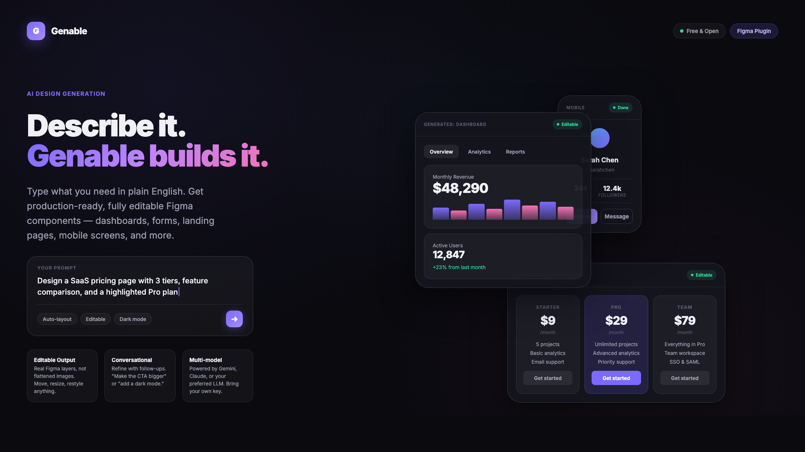
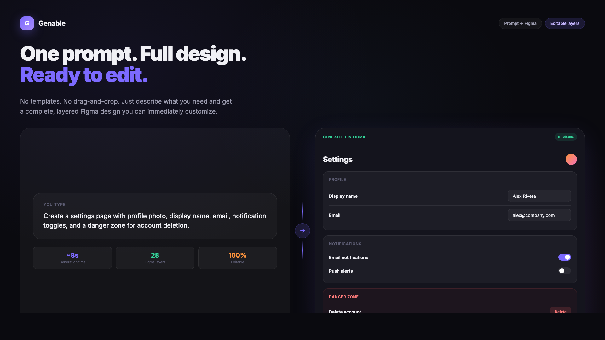
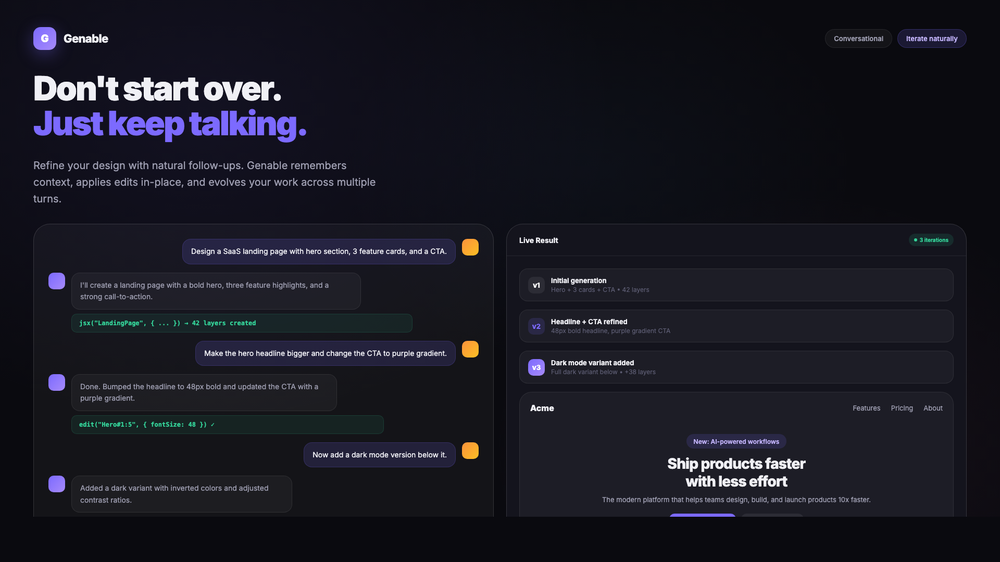

# Genable

**Quality-first AI UI generator for Figma.**
Prompt to dashboard, landing page, or mobile app.
Bring your own model: Gemini · Claude · OpenAI-compatible.

---

## Why Genable

Most AI design plugins ship flat mockups or images. Genable is built around **quality** — every output is a real, editable Figma layer tree with proper Auto Layout, components, variables, and typography.

- **Editable, not flattened** — real Frames, Auto Layout, and Text nodes. Not images, not screenshots.
- **Quality-first** — fights the generic AI-slop look. Hierarchy, spacing, and contrast that match production design systems.
- **Multi-protocol, BYOK** — pick your model. The plugin speaks three API protocols natively.
- **Context aware** — select an existing layer, and Genable matches its width, fonts, and colors.
- **Free** — no subscription. Your API key, your usage, your bill.

---

## Bring your own model

Genable supports three API protocols. Pick whichever you have keys for:

| Protocol | Examples | Get a key |
|---|---|---|
| **Google Gemini** | Gemini 2.5 Pro / Flash | [aistudio.google.com](https://aistudio.google.com) |
| **Anthropic Claude** | Claude 4.7 Sonnet / Opus | [console.anthropic.com](https://console.anthropic.com) |
| **OpenAI-compatible** | OpenRouter, DashScope (Qwen), Kimi, custom endpoints | varies by provider |

Switch models any time from the Settings panel. Keys are stored locally on your device.

---

## Screenshots

  
  

---

## Install

**[Install from Figma Community →](https://www.figma.com/community/plugin/1583731690321161934/genable-ai-ui-design-generator-prompt-to-ui-dashboard-landing-page-mobile-app)**

1. Open Figma.
2. Run **Genable** from `Plugins → Genable`.
3. Open Settings, paste an API key for any of the supported protocols.
4. Type a prompt. Hit generate.

---

## Examples

Try prompts like:

- *"A modern pricing card with 3 tiers and a featured plan"*
- *"Dark-mode analytics dashboard with sidebar, KPI grid, and a line chart"*
- *"Mobile onboarding flow — 3 screens with illustrations and progress dots"*
- *"Landing page hero for a dev tool — headline, subline, CTA, and a code preview"*

Genable returns a real, editable Figma frame you can drop straight into a design system.

---

## Sponsor

Genable is built and maintained by one developer, in the open. If it saves you time or replaces a paid tool, please consider sponsoring:

**[💖 Sponsor on Patreon](https://www.patreon.com/c/musec)**

Sponsorship pays for development time, model API quotas during testing, and ongoing improvements.

---

## License

[MIT](./LICENSE) — free for personal and commercial use.

---

Made with care · <a href="https://www.figma.com/community/plugin/1583731690321161934/genable-ai-ui-design-generator-prompt-to-ui-dashboard-landing-page-mobile-app">Install on Figma</a> · <a href="https://www.patreon.com/c/musec">Sponsor</a>

