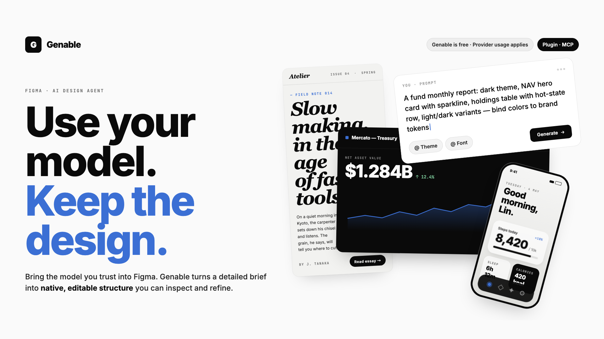
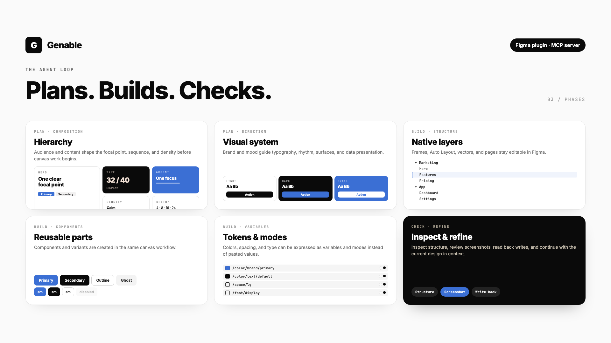
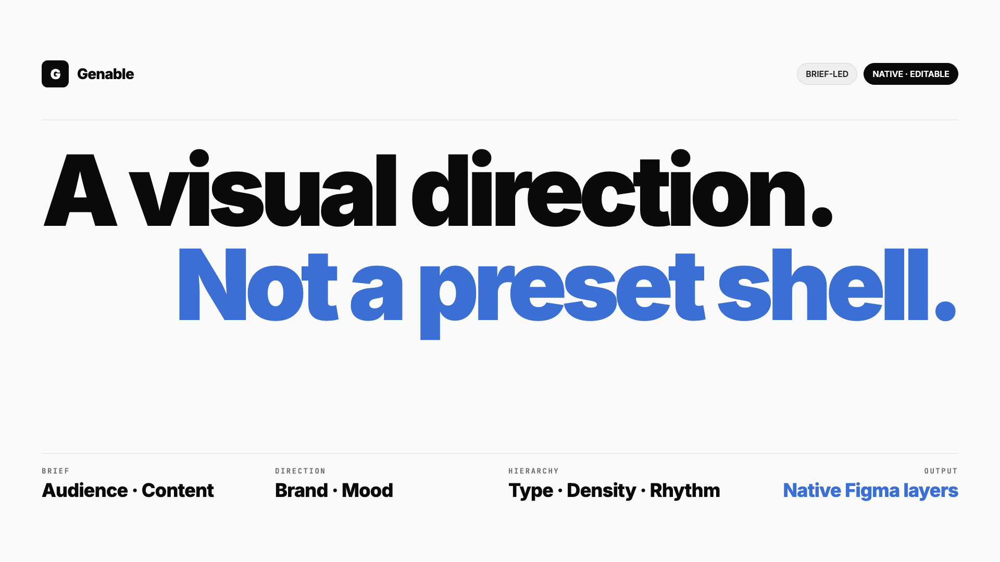
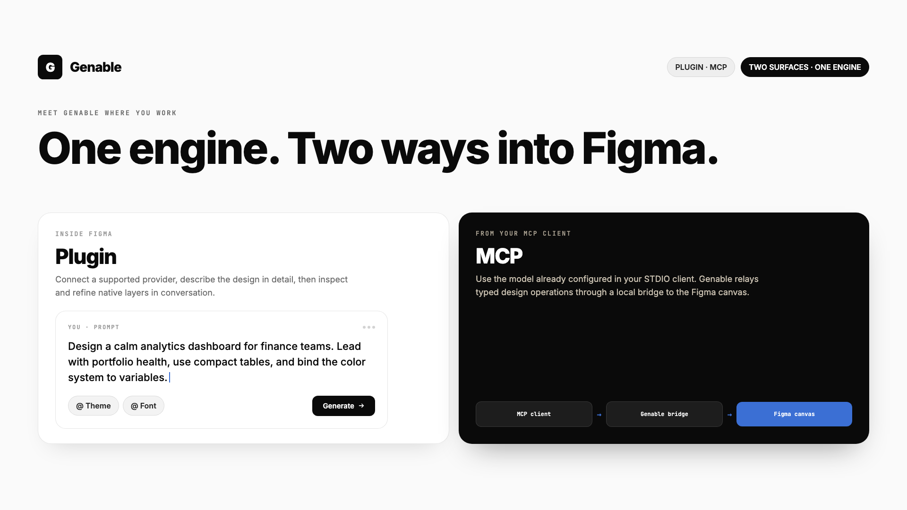

<div align="center">


# Genable

**Use your model. Keep the design.**

Turn a detailed brief into native, editable Figma structure you can inspect and refine.

[](https://www.figma.com/community/plugin/1583731690321161934)
[](https://genable.pages.dev)
[](https://www.npmjs.com/package/genable-mcp)
[](https://www.patreon.com/c/musec)



</div>

---

## A design agent with a canvas to act on

Genable runs an agent loop against Figma's scene graph through typed design
operations. It can plan a composition, build native structure, inspect the
result, and continue refining it in context.

- **Plan the direction** — Make audience, content, hierarchy, brand, mood,
  typography, density, and rhythm part of the brief.
- **Build native structure** — Create and edit frames, Auto Layout, vectors,
  text, components, variables, and pages instead of returning one flat image.
- **Check the work** — Inspect structure, read back writes, and use screenshots
  for visual verification when useful.
- **Keep refining** — Continue the conversation with the current canvas in
  context; every generated layer remains available to edit in Figma.



---

## A visual direction, not a preset shell

Generic output often begins with a generic brief. Genable's design guidance
pushes the model to treat composition, hierarchy, typography, density, rhythm,
surfaces, and data presentation as connected decisions—not as a card grid with
a new accent color.

No tool can guarantee taste. The model, source material, and judgment still
matter. Genable keeps intent explicit and the result inspectable so refinement
stays inside the workflow.



---

## Choose the model that fits the brief

The Figma plugin supports provider presets and configurable compatible
endpoints across three protocol families. It validates the provider before the
first run and lets you switch models later without hard-coding this page to a
specific model version.

| Protocol | Typical connections |
|---|---|
| **OpenAI-compatible** | OpenAI, OpenRouter, Moonshot, DeepSeek, DashScope, compatible endpoints |
| **Anthropic-compatible** | Anthropic and compatible endpoints |
| **Gemini** | Google AI Studio |

Provider credentials are stored in Figma client storage. Requests go to the
endpoint you configure; some presets can use a relay when browser-network
constraints require it. Provider billing and limits still apply.

---

## One engine, two ways into Figma



### Inside Figma: the plugin

1. [Install Genable from Figma Community](https://www.figma.com/community/plugin/1583731690321161934).
2. Add a supported provider or compatible endpoint in Settings.
3. Describe the design in detail, then inspect and refine the native layers in
   conversation.

### From an MCP client: `genable-mcp`

Use the model already configured in a STDIO MCP client. `genable-mcp` provides
a local, plugin-backed bridge for creating, editing, inspecting, and visually
verifying Figma designs; it does not require a second model API key inside
Genable.

```json
{
  "mcpServers": {
    "genable": {
      "command": "npx",
      "args": ["-y", "genable-mcp"]
    }
  }
}
```

Keep the Genable plugin running in Figma desktop, then ask your client to list
the pages in the current file. See the [current package docs](https://www.npmjs.com/package/genable-mcp)
for client-specific setup and the live tool schema.

---

## Example briefs

Detail gives the model a real direction to work with. Adapt one of these to your
product rather than treating it as a guaranteed output recipe:

- *“SaaS pricing page — three tiers, monthly/annual toggle, featured Pro plan,
  dark mode, and brand color bound to variables.”*
- *“Analytics dashboard — sidebar, KPI grid with sparklines, compact holdings
  table, dark and light modes, and a calm editorial hierarchy.”*
- *“Mobile onboarding — three screens with progress, illustration direction,
  named type scale, spacing rhythm, and one clear primary action.”*
- *“Landing hero — audience and value proposition first, dual CTA, code preview,
  Inter typography, and an 8pt spacing scale.”*

---

## Sponsor

Genable is maintained by one developer. Sponsorship supports development time,
real-model evaluation, and ongoing plugin and MCP improvements.

**[Sponsor on Patreon →](https://www.patreon.com/c/musec)**

---

## License

The material in this public repository and the `genable-mcp` package are
MIT-licensed. The Figma Community plugin is free; model-provider usage may be
billed separately.

---

<div align="center">
<sub>
<a href="https://www.figma.com/community/plugin/1583731690321161934">Figma plugin</a>
 ·
<a href="https://www.npmjs.com/package/genable-mcp">MCP server</a>
 ·
<a href="https://genable.pages.dev">Website</a>
 ·
<a href="https://github.com/musepy/genable">Public project page</a>
 ·
<a href="https://www.patreon.com/c/musec">Sponsor</a>
</sub>
</div>
