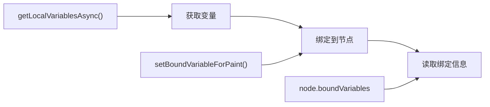
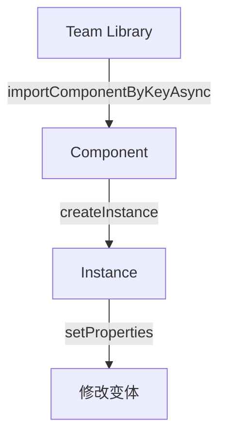
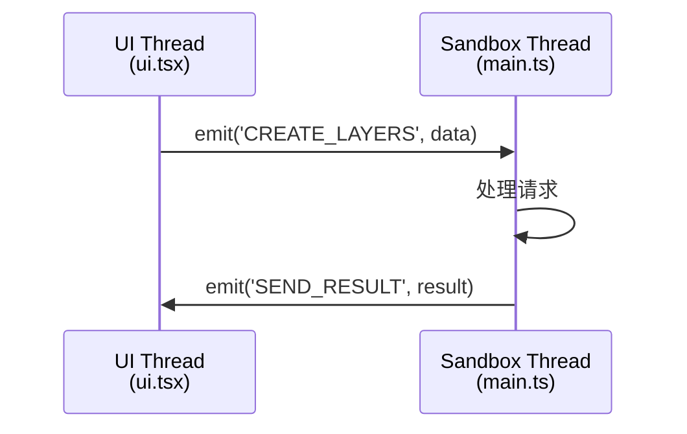

# Figma Plugin API 速查手册

> 面向 Genable 插件开发的常用 API 参考

---

## 全局对象

| 对象 | 用途 |
|------|------|
| `figma` | 主入口对象 |
| `figma.root` | 文档根节点 |
| `figma.currentPage` | 当前页面 |
| `figma.viewport` | 视口控制 |
| `figma.variables` | Variables API |
| `figma.teamLibrary` | 团队库 (需权限) |

---

## 节点操作

### 创建节点

```typescript
// Frame (最常用)
const frame = figma.createFrame();
frame.name = "Card";
frame.resize(300, 200);
frame.fills = [{ type: 'SOLID', color: { r: 1, g: 1, b: 1 } }];

// Text (必须先加载字体!)
const text = figma.createText();
await figma.loadFontAsync({ family: "Inter", style: "Regular" });
text.characters = "Hello World";
text.fontSize = 16;

// Rectangle
const rect = figma.createRectangle();

// Vector (需要 SVG 路径)
const vector = figma.createVector();
```

### 选择与查找

```typescript
// 获取选中节点
figma.currentPage.selection

// 按 ID 查找
figma.getNodeById("123:456")

// 遍历所有节点
figma.currentPage.findAll(node => node.type === 'TEXT')

// 按名称查找
figma.currentPage.findAll(node => node.name === 'Button')
```

### 节点层级

| 方法 | 用途 |
|------|------|
| `parent.appendChild(child)` | 添加子节点 |
| `parent.insertChild(0, child)` | 插入到指定位置 |
| `node.remove()` | 移除节点 |
| `node.clone()` | 克隆节点 |

---

## 样式属性

### 填充 (Fills)

```typescript
// 纯色填充
node.fills = [{ 
  type: 'SOLID', 
  color: { r: 0.12, g: 0.47, b: 1 },  // RGB 0-1
  opacity: 1 
}];

// 渐变填充
node.fills = [{
  type: 'GRADIENT_LINEAR',
  gradientTransform: [[1, 0, 0], [0, 1, 0]],
  gradientStops: [
    { position: 0, color: { r: 1, g: 0, b: 0, a: 1 } },
    { position: 1, color: { r: 0, g: 0, b: 1, a: 1 } }
  ]
}];
```

### 描边 (Strokes)

| 属性 | 类型 | 说明 |
|------|------|------|
| `strokes` | `Paint[]` | 描边颜色 |
| `strokeWeight` | `number` | 描边宽度 |
| `strokeAlign` | `'INSIDE' \| 'OUTSIDE' \| 'CENTER'` | 描边对齐 |

### 圆角

```typescript
// 统一圆角
node.cornerRadius = 8;

// 混合圆角
node.topLeftRadius = 8;
node.topRightRadius = 8;
node.bottomRightRadius = 0;
node.bottomLeftRadius = 0;
```

### 效果 (Effects)

```typescript
node.effects = [{
  type: 'DROP_SHADOW',
  color: { r: 0, g: 0, b: 0, a: 0.25 },
  offset: { x: 0, y: 4 },
  radius: 8,
  spread: 0,
  visible: true,
  blendMode: 'NORMAL'
}];
```

---

## Auto Layout

### 属性一览

| 属性 | 值类型 | 说明 |
|------|--------|------|
| `layoutMode` | `'VERTICAL' \| 'HORIZONTAL' \| 'NONE'` | 布局方向 |
| `itemSpacing` | `number` | 子元素间距 |
| `paddingTop/Right/Bottom/Left` | `number` | 内边距 |
| `primaryAxisAlignItems` | `'MIN' \| 'CENTER' \| 'MAX' \| 'SPACE_BETWEEN'` | 主轴对齐 |
| `counterAxisAlignItems` | `'MIN' \| 'CENTER' \| 'MAX'` | 交叉轴对齐 |

### 子元素尺寸

```typescript
child.layoutSizingHorizontal = 'FILL';  // 'FIXED' | 'HUG' | 'FILL'
child.layoutSizingVertical = 'HUG';
```

### 🔴 CRITICAL: layoutAlign vs layoutGrow

> **这是最容易混淆的 Figma API 概念！**

| 属性 | 作用 | 影响的轴 |
|------|------|----------|
| `layoutAlign` | 控制子元素在**交叉轴**上的延展 | 垂直父→控制宽度, 水平父→控制高度 |
| `layoutGrow` | 控制子元素在**主轴**上的延展 | 垂直父→控制高度, 水平父→控制宽度 |

#### 作用范围对照表

| 父容器方向 | 想让子元素**宽度 FILL** | 想让子元素**高度 FILL** |
|-----------|------------------------|------------------------|
| `VERTICAL` | ✅ `layoutAlign = 'STRETCH'` | `layoutGrow = 1` |
| `HORIZONTAL` | `layoutGrow = 1` | ✅ `layoutAlign = 'STRETCH'` |

#### 常见错误

```typescript
// ❌ 错误: 在 VERTICAL 父容器中用 layoutGrow 让子元素宽度填满
// 这会让子元素高度无限增长，而不是宽度！
parentFrame.layoutMode = 'VERTICAL';
childFrame.layoutGrow = 1;  // 结果: 高度变大，宽度不变

// ✅ 正确做法
parentFrame.layoutMode = 'VERTICAL';
childFrame.layoutAlign = 'STRETCH';  // 宽度会填满父容器
```

#### 记忆口诀

> **"layoutAlign 控制垂直于布局方向的轴"**
> - VERTICAL 布局 → layoutAlign 控制**宽度**
> - HORIZONTAL 布局 → layoutAlign 控制**高度**

### 完整示例

```typescript
const frame = figma.createFrame();
frame.layoutMode = 'VERTICAL';
frame.itemSpacing = 16;
frame.paddingTop = 16;
frame.paddingRight = 16;
frame.paddingBottom = 16;
frame.paddingLeft = 16;
frame.primaryAxisAlignItems = 'CENTER';
frame.counterAxisAlignItems = 'CENTER';
```

---

## 文本

### 属性一览

| 属性 | 类型 | 说明 |
|------|------|------|
| `characters` | `string` | 文本内容 |
| `fontName` | `{ family, style }` | 字体 (需先加载) |
| `fontSize` | `number` | 字号 |
| `textAlignHorizontal` | `'LEFT' \| 'CENTER' \| 'RIGHT' \| 'JUSTIFIED'` | 水平对齐 |
| `textAutoResize` | `'NONE' \| 'HEIGHT' \| 'WIDTH_AND_HEIGHT'` | 自适应模式 |

### 完整示例

```typescript
const text = figma.createText();

// 必须先加载字体!
await figma.loadFontAsync({ family: "Inter", style: "Medium" });

text.characters = "Button";
text.fontSize = 14;
text.fontName = { family: "Inter", style: "Medium" };
text.textAlignHorizontal = 'CENTER';
text.textAutoResize = 'WIDTH_AND_HEIGHT';
```

---

## Variables

### API 流程



### 常用操作

```typescript
// 获取本地颜色变量
const colorVars = await figma.variables.getLocalVariablesAsync('COLOR');

// 按 ID 获取变量
const variable = await figma.variables.getVariableByIdAsync(variableId);

// 绑定变量到节点
const paint = figma.variables.setBoundVariableForPaint(
  existingPaint,
  'color',
  variable
);
node.fills = [paint];

// 检查节点绑定的变量
node.boundVariables  // { fills: [...], strokes: [...], ... }
```

---

## 组件与实例

### 操作流程



### 常用操作

```typescript
// 创建组件
const component = figma.createComponent();

// 创建实例
const instance = component.createInstance();

// 从库导入组件 (需要 teamlibrary 权限)
const importedComponent = await figma.importComponentByKeyAsync("key");
const instance = importedComponent.createInstance();

// 修改实例变体属性
instance.setProperties({ "Type": "Primary", "Size": "Large" });
```

---

## UI 通信

### 消息流



### 代码示例

```typescript
// 从 UI 发送到 Sandbox
import { emit } from '@create-figma-plugin/utilities';
emit('CREATE_LAYERS', dslData);

// 从 Sandbox 发送到 UI
import { emit } from '@create-figma-plugin/utilities';
emit('SEND_RESULT', { success: true, data: {...} });

// 接收消息
import { on } from '@create-figma-plugin/utilities';
on('CREATE_LAYERS', (data) => {
  console.log('Received:', data);
});
```

---

## 调试命令速查

### Console 直接执行

```typescript
// 检查选中节点完整属性
JSON.stringify(figma.currentPage.selection[0], null, 2)

// 获取节点的字体
figma.currentPage.selection[0].fontName

// 获取所有本地样式
figma.getLocalPaintStyles()
figma.getLocalTextStyles()
figma.getLocalEffectStyles()

// 切换页面
figma.currentPage = figma.root.children[1]

// 缩放到选中内容
figma.viewport.scrollAndZoomIntoView(figma.currentPage.selection)
```

---

## 常见陷阱

| 问题 | 原因 | 解决方案 |
|------|------|---------|
| `Font not loaded` | 未加载字体 | 先调用 `figma.loadFontAsync(...)` |
| `Cannot read 'children'` | 节点无子节点 | 检查 `'children' in node` |
| 属性返回 `Mixed` | 多种值 | 需检查具体属性 |
| 变量是 `VariableAlias` | 未解析 | 使用 `resolveForConsumer()` |

---

## 官方参考

| 资源 | 链接 |
|------|------|
| API Reference | [figma.com/plugin-docs/api](https://www.figma.com/plugin-docs/api/api-overview/) |
| Node Types | [figma.com/plugin-docs/api/nodes](https://www.figma.com/plugin-docs/api/nodes/) |
| Variables API | [figma.com/plugin-docs/api/figma-variables](https://www.figma.com/plugin-docs/api/figma-variables/) |
| TypeScript Typings | [figma.com/plugin-docs/api/typings](https://www.figma.com/plugin-docs/api/typings/) |
