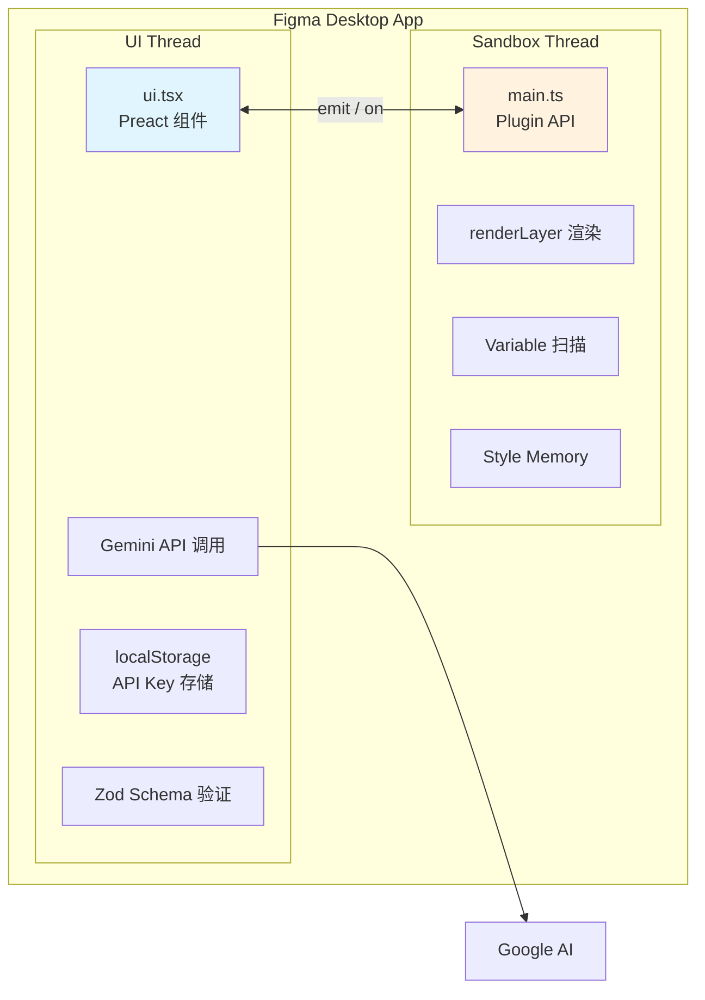
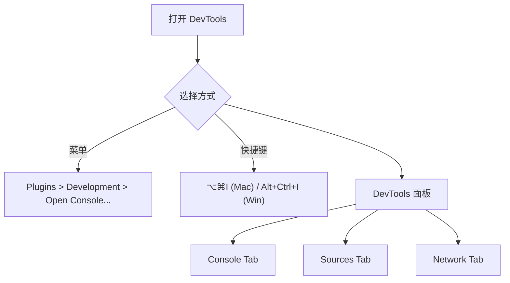
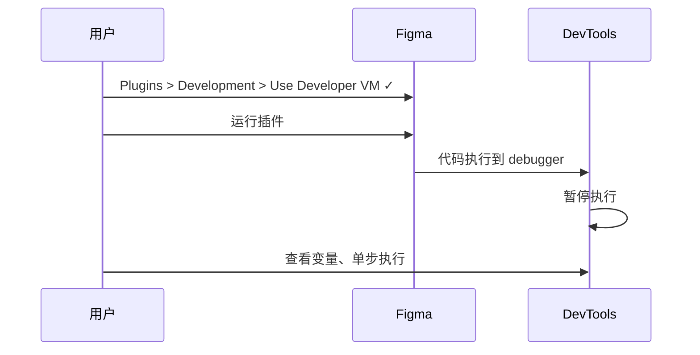
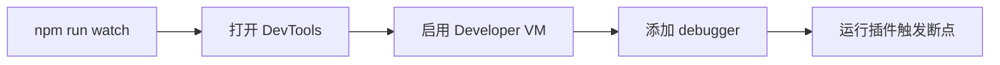
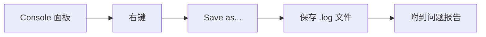

# Genable 插件调试与测试指南

> DevTools 使用 + Console 诊断 + 问题反馈规范

---

## 技术栈概览

| 技术 | 用途 | 版本 |
|------|------|------|
| **TypeScript** | 类型安全开发 | >=5 |
| **Preact** | UI 框架 (React 轻量替代) | >=10 |
| **@create-figma-plugin** | 插件脚手架 & UI 组件库 | ^4.0.3 |
| **@google/generative-ai** | Gemini AI API | ^0.24.1 |
| **Zod** | JSON Schema 验证 (自愈能力) | ^4.2.1 |
| **@figma/plugin-typings** | Figma API 类型定义 | 1.109.0 |

---

## 插件架构 (双线程模型)



### 线程职责

| 线程 | 源文件 | 职责 | 可访问 |
|------|--------|------|--------|
| **UI Thread** | `src/ui.tsx` | 用户交互、网络请求、配置存储 | `localStorage`, `fetch` |
| **Sandbox Thread** | `src/main.ts` | Figma API 操作、节点渲染 | `figma.*` |

---

## 打开 DevTools

### 入口方式



### 面板功能

| Tab | 用途 | 使用场景 |
|-----|------|----------|
| **Console** | 查看日志、执行代码 | 日常调试、API 探索 |
| **Sources** | 查看源码、设置断点 | 需开启 Developer VM |
| **Network** | 查看网络请求 | 排查 Gemini API 问题 |

---

## Console 调试方法

### 探索 Figma API

```typescript
// 查看当前页面对象
figma.currentPage

// 查看选中的节点
figma.currentPage.selection

// 获取第一个选中节点属性
figma.currentPage.selection[0]

// 获取所有本地颜色变量
await figma.variables.getLocalVariablesAsync('COLOR')

// 打印节点树结构
function printTree(node, depth = 0) {
  console.log('  '.repeat(depth) + node.name + ' (' + node.type + ')');
  if ('children' in node) node.children.forEach(c => printTree(c, depth + 1));
}
printTree(figma.currentPage.selection[0])
```

### 日志级别

| 方法 | 控制台显示 | 用途 |
|------|-----------|------|
| `console.log()` | 普通文本 | 一般输出 |
| `console.warn()` | ⚠️ 黄色警告 | 潜在问题 |
| `console.error()` | ❌ 红色错误 | 严重问题 |
| `console.table()` | 表格格式 | 数组/对象 |

---

## Developer VM 调试模式

### 启用步骤



### 设置断点

```typescript
// 在代码中添加 debugger 语句
async function renderLayer(d: any, p: any): Promise<SceneNode | null> {
  debugger;  // 👈 执行到这里会暂停
  
  const frame = figma.createFrame();
  // ...
}
```

### 调试快捷键

| 快捷键 | 功能 |
|--------|------|
| `F8` | 继续执行 |
| `F10` | 单步跳过 |
| `F11` | 单步进入 |
| `Shift+F11` | 跳出函数 |

---

## 常用调试技巧

### 阻止插件自动关闭

```typescript
// 调试时临时注释掉关闭调用
// figma.closePlugin();  // 👈 注释这行

// 或使用条件判断
if (process.env.NODE_ENV !== 'development') {
  figma.closePlugin();
}
```

### 关键日志定位

| 问题类型 | 搜索关键词 | 源文件 |
|---------|-----------|--------|
| 生成失败 | `[Genable] AI` | `ui.tsx` |
| 渲染失败 | `renderLayer` | `main.ts` |
| Schema 验证 | `Zod`, `parse` | `schema.ts` |
| 图层过滤 | `Filter:`, `Excluded:` | `layerFilter.ts` |
| Variable 问题 | `Variable:` | `main.ts` |

---

## 面向不同角色的指南

### 开发者



**核心文件定位**

| 问题类型 | 查看文件 | 关键函数 |
|---------|---------|----------|
| UI 不响应 | `src/ui.tsx` | `Plugin()` |
| 渲染失败 | `src/main.ts` | `renderLayer()` |
| Schema 验证 | `src/schema.ts` | `NodeSchema` |
| AI 输出异常 | `src/services/gemini.ts` | `generateLayout()` |
| 图层过滤 | `src/layerFilter.ts` | `scoreLayer()` |

---

### 产品经理

**关注日志信号**

| 日志关键词 | 含义 | 影响级别 |
|-----------|------|---------|
| `✅ Generated` | 生成成功 | 正常 |
| `Font not found` | 缺少字体 | ⚠️ 可能影响显示 |
| `Variable not found` | 变量不存在 | ⚠️ 颜色回退 |
| `Invalid DSL` | AI 输出格式错误 | ❌ 生成失败 |
| `Rate limit` | API 限流 | ❌ 需要等待 |

---

### UX 设计师

**设计规范检查**

```typescript
// 在 Console 检查选中节点

// 1. 是否使用语义化命名
figma.currentPage.selection[0].name  
// ✅ "Button/Primary" 
// ❌ "Frame 123"

// 2. 是否使用 Auto Layout
figma.currentPage.selection[0].layoutMode  
// ✅ "VERTICAL" | "HORIZONTAL"

// 3. 是否绑定 Variable
figma.currentPage.selection[0].boundVariables  
// ✅ { fills: [...] }

// 4. 圆角是否为标准值
figma.currentPage.selection[0].cornerRadius
// ✅ 4, 8, 12, 16, 24
```

---

## 问题反馈模板 (LLM 友好)

### 标准格式

```markdown
## 问题描述
<!-- 一句话描述问题 -->

## 复现步骤
1. 
2. 
3. 

## 期望结果
<!-- 描述期望行为 -->

## 实际结果
<!-- 描述实际行为 -->

## Console 日志
```
<!-- 右键 Console > Save as... 保存日志 -->
```

## 环境信息
- Figma 版本: 
- 操作系统: 
- 插件版本: 
```

### 保存 Console 日志



---

## 常见问题速查

| 问题 | 原因 | 解决方案 |
|------|------|---------|
| `(...)` 点击无响应 | 插件已关闭 | 重新运行插件 |
| 看不到 Sources 面板 | Developer VM 未启用 | 启用 Use Developer VM |
| 日志太多 | 未过滤 | 使用筛选或搜索框 |
| 网络请求失败 | API 问题 | 查看 Network Tab |

---

## 官方资源

| 资源 | 链接 |
|------|------|
| Plugin API 文档 | [figma.com/plugin-docs](https://www.figma.com/plugin-docs/api/api-overview/) |
| 调试指南 | [figma.com/plugin-docs/debugging](https://www.figma.com/plugin-docs/debugging/) |
| 社区 Discord | [discord.gg/figma](https://discord.gg/figma) |
| GitHub 示例 | [github.com/figma/widget-samples](https://github.com/figma/widget-samples) |
