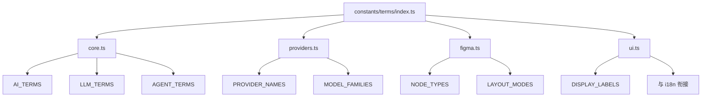
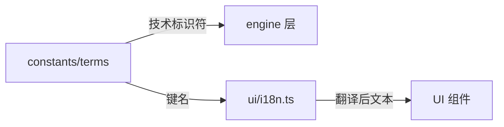

# TypeScript 术语常量集中管理方案

## 1. 项目现状分析

### 1.1 现有架构特点

基于对 Figma AI Generator 插件项目的分析，发现以下特点：

```
src/
├── constants/           # 核心常量（featureFlags, prompts, layoutRules）
├── engine/              # 引擎层（llm-client, agent, figma-adapter）
│   ├── agent/           # Agent 运行时
│   ├── llm-client/      # LLM 客户端（providers, config, modelFilter）
│   └── figma-adapter/   # Figma 适配器
├── ui/                  # UI 层
│   ├── constants/       # UI 专用常量（models.ts）
│   ├── i18n.ts          # 国际化
│   └── components/      # 组件
└── config/              # 配置管理
```

### 1.2 术语散落问题

搜索发现以下术语在代码中散落使用：

| 术语 | 出现次数 | 主要位置 |
|------|----------|----------|
| `LLM` / `llm` | 100+ | engine/llm-client, constants, types |
| `Agent` / `agent` | 80+ | engine/agent, services |
| `Model` / `model` | 150+ | ui/constants, hooks, providers |
| `Provider` | 50+ | engine/llm-client/providers |
| `Gemini` | 60+ | providers, modelFilter, config |
| `generative ai` / `genAI` | 10+ | legacy_pipeline |

### 1.3 现有 i18n 实现

项目已有简单的 i18n 系统（[`src/ui/i18n.ts`](src/ui/i18n.ts)）：
- 支持 `en` / `zh` 两种语言
- 使用对象字面量存储翻译
- 通过 `detectLocale()` 自动检测语言
- 导出 `t` 对象供组件使用

---

## 2. 术语常量文件组织结构

### 2.1 推荐目录结构

```
src/
├── constants/
│   ├── index.ts                    # 统一导出
│   ├── terms/                      # 术语常量目录
│   │   ├── index.ts                # 术语统一导出
│   │   ├── core.ts                 # 核心术语（AI, LLM, Agent 等）
│   │   ├── providers.ts            # 提供商术语（Gemini, OpenAI 等）
│   │   ├── figma.ts                # Figma 相关术语
│   │   └── ui.ts                   # UI 展示术语（与 i18n 衔接）
│   ├── featureFlags.ts             # 现有
│   ├── prompts.ts                  # 现有
│   └── ...
```

### 2.2 按领域分层设计



---

## 3. 命名规范

### 3.1 推荐规范

| 类型 | 命名规范 | 示例 |
|------|----------|------|
| 常量对象 | `UPPER_SNAKE_CASE` | `AI_TERMS`, `LLM_PROVIDERS` |
| 常量键 | `UPPER_SNAKE_CASE` | `GENERATIVE_AI`, `LARGE_LANGUAGE_MODEL` |
| 常量值 | 原始字符串 | `"generative AI"`, `"LLM"` |
| 类型名 | `PascalCase` | `AiTerm`, `ProviderName` |
| 辅助函数 | `camelCase` | `getTermLabel()`, `isValidProvider()` |

### 3.2 与现有代码风格一致性

参考项目现有风格：
- [`featureFlags.ts`](src/constants/featureFlags.ts): `FEATURE_FLAGS` (UPPER_SNAKE_CASE)
- [`models.ts`](src/ui/constants/models.ts): `DEFAULT_MODEL`, `SUPPORTED_MODELS`
- [`figma-api.ts`](src/constants/figma-api.ts): `PROPS`, `NODE_TYPES`

**结论**: 采用 `UPPER_SNAKE_CASE` 作为常量命名规范，与项目现有风格保持一致。

---

## 4. 类型安全实现

### 4.1 推荐方案：`as const` + 类型推导

```typescript
// src/constants/terms/core.ts

/**
 * AI 核心术语常量
 * 使用 as const 确保字面量类型推导
 */
export const AI_TERMS = {
  /** 生成式 AI */
  GENERATIVE_AI: 'generative AI',
  /** 大语言模型 */
  LARGE_LANGUAGE_MODEL: 'LLM',
  /** 智能体 */
  AGENT: 'agent',
  /** 模型 */
  MODEL: 'model',
  /** 提供商 */
  PROVIDER: 'provider',
  /** 推理 */
  INFERENCE: 'inference',
  /** 思考模式 */
  THINKING_MODE: 'thinking mode',
} as const;

// 类型推导
export type AiTermKey = keyof typeof AI_TERMS;
export type AiTermValue = typeof AI_TERMS[AiTermKey];

// 类型守卫
export function isAiTerm(value: string): value is AiTermValue {
  return Object.values(AI_TERMS).includes(value as AiTermValue);
}
```

### 4.2 为什么不用 `enum`

| 特性 | `as const` | `enum` |
|------|------------|--------|
| Tree-shaking | ✅ 完全支持 | ❌ 生成额外代码 |
| 类型推导 | ✅ 字面量类型 | ⚠️ 需要额外处理 |
| 运行时开销 | ✅ 零开销 | ❌ 生成对象 |
| IDE 支持 | ✅ 完整 | ✅ 完整 |
| 与现有代码一致 | ✅ 项目已使用 | ❌ 项目未使用 |

### 4.3 完整类型定义示例

```typescript
// src/constants/terms/providers.ts

export const PROVIDER_NAMES = {
  GEMINI: 'Gemini',
  OPENAI: 'OpenAI',
  ANTHROPIC: 'Anthropic',
  GOOGLE_AI: 'Google AI',
} as const;

export const MODEL_FAMILIES = {
  GEMINI_2_5: 'gemini-2.5',
  GEMINI_3: 'gemini-3',
  GPT_4: 'gpt-4',
  CLAUDE: 'claude',
} as const;

// 组合类型
export type ProviderName = typeof PROVIDER_NAMES[keyof typeof PROVIDER_NAMES];
export type ModelFamily = typeof MODEL_FAMILIES[keyof typeof MODEL_FAMILIES];

// 提供商配置类型
export interface ProviderConfig {
  name: ProviderName;
  families: ModelFamily[];
  apiEndpoint: string;
}
```

---

## 5. 与 i18n 国际化衔接策略

### 5.1 分层设计



### 5.2 衔接实现

```typescript
// src/constants/terms/ui.ts

import { AI_TERMS } from './core';

/**
 * UI 展示术语 - 作为 i18n 的键名
 * 这些键会在 i18n.ts 中被翻译
 */
export const UI_TERM_KEYS = {
  GENERATIVE_AI: 'terms.generativeAi',
  LLM: 'terms.llm',
  AGENT: 'terms.agent',
  MODEL: 'terms.model',
  THINKING_MODE: 'terms.thinkingMode',
} as const;

// 类型安全的 i18n 键
export type UiTermKey = typeof UI_TERM_KEYS[keyof typeof UI_TERM_KEYS];
```

```typescript
// src/ui/i18n.ts (扩展)

const translations = {
  en: {
    // ... 现有翻译
    
    // 术语翻译
    terms: {
      generativeAi: 'Generative AI',
      llm: 'Large Language Model',
      agent: 'AI Agent',
      model: 'Model',
      thinkingMode: 'Thinking Mode',
    },
  },
  zh: {
    // ... 现有翻译
    
    // 术语翻译
    terms: {
      generativeAi: '生成式 AI',
      llm: '大语言模型',
      agent: 'AI 智能体',
      model: '模型',
      thinkingMode: '思考模式',
    },
  },
} as const;
```

### 5.3 使用示例

```typescript
// 在组件中使用
import { t } from '../i18n';
import { UI_TERM_KEYS } from '../../constants/terms';

function ModelSelector() {
  // 类型安全的翻译访问
  const label = t.terms.llm; // "Large Language Model" 或 "大语言模型"
  
  return <div>{label}</div>;
}
```

---

## 6. 迁移示例

### 6.1 迁移前（硬编码）

```typescript
// src/engine/llm-client/providers/gemini.ts (迁移前)
export class GeminiProvider implements LLMProvider {
  public readonly name = 'gemini';  // 硬编码
  // ...
}

// src/_archive/legacy_pipeline/distributedGenerator.ts (迁移前)
private genAI: GoogleGenerativeAI;  // 变量名暗示术语
console.log('[Agent] Progress: ...');  // 硬编码日志前缀
```

### 6.2 迁移后（集中管理）

```typescript
// src/constants/terms/core.ts
export const AI_TERMS = {
  AGENT: 'agent',
  LLM: 'LLM',
  GENERATIVE_AI: 'generative AI',
} as const;

// src/constants/terms/providers.ts
export const PROVIDER_NAMES = {
  GEMINI: 'Gemini',
} as const;

export const LOG_PREFIXES = {
  AGENT: '[Agent]',
  LLM: '[LLM]',
  PROVIDER: '[Provider]',
} as const;
```

```typescript
// src/engine/llm-client/providers/gemini.ts (迁移后)
import { PROVIDER_NAMES } from '../../../constants/terms';

export class GeminiProvider implements LLMProvider {
  public readonly name = PROVIDER_NAMES.GEMINI.toLowerCase();
  // ...
}

// src/engine/services/AgentOrchestrator.ts (迁移后)
import { LOG_PREFIXES } from '../../constants/terms';

console.log(`${LOG_PREFIXES.AGENT} Progress: ${chunk}`);
```

### 6.3 迁移检查清单

- [ ] 搜索所有 `'agent'` / `"agent"` 字符串
- [ ] 搜索所有 `'llm'` / `"llm"` / `'LLM'` 字符串
- [ ] 搜索所有 `'model'` / `"model"` 字符串
- [ ] 搜索所有 `'gemini'` / `"Gemini"` 字符串
- [ ] 搜索所有 `'generative'` 相关字符串
- [ ] 更新日志前缀使用 `LOG_PREFIXES`
- [ ] 更新 Provider 名称使用 `PROVIDER_NAMES`
- [ ] 更新 i18n 翻译使用 `UI_TERM_KEYS`

---

## 7. 完整代码示例

### 7.1 `src/constants/terms/index.ts`

```typescript
/**
 * @file index.ts
 * @description 术语常量统一导出
 */

export * from './core';
export * from './providers';
export * from './figma';
export * from './ui';
```

### 7.2 `src/constants/terms/core.ts`

```typescript
/**
 * @file core.ts
 * @description AI/LLM 核心术语常量
 * 
 * 使用场景：
 * - 日志输出
 * - 类型定义
 * - 配置键名
 */

// ==========================================
// AI 核心术语
// ==========================================

export const AI_TERMS = {
  /** 生成式 AI - 用于描述整体技术领域 */
  GENERATIVE_AI: 'generative AI',
  /** 大语言模型 - 技术术语 */
  LARGE_LANGUAGE_MODEL: 'LLM',
  /** 智能体 - Agent 架构 */
  AGENT: 'agent',
  /** 模型 - 通用术语 */
  MODEL: 'model',
  /** 提供商 - LLM 服务提供商 */
  PROVIDER: 'provider',
  /** 推理 - 模型推理过程 */
  INFERENCE: 'inference',
  /** 思考模式 - Gemini 3.0+ 特性 */
  THINKING_MODE: 'thinking mode',
  /** 工具调用 - Function Calling */
  TOOL_CALLING: 'tool calling',
  /** 流式输出 */
  STREAMING: 'streaming',
} as const;

// ==========================================
// 日志前缀
// ==========================================

export const LOG_PREFIXES = {
  AGENT: '[Agent]',
  LLM: '[LLM]',
  PROVIDER: '[Provider]',
  FIGMA: '[Figma]',
  RENDER: '[Render]',
  TOOL: '[Tool]',
} as const;

// ==========================================
// 类型定义
// ==========================================

export type AiTermKey = keyof typeof AI_TERMS;
export type AiTermValue = typeof AI_TERMS[AiTermKey];
export type LogPrefix = typeof LOG_PREFIXES[keyof typeof LOG_PREFIXES];

// ==========================================
// 辅助函数
// ==========================================

/**
 * 检查是否为有效的 AI 术语
 */
export function isAiTerm(value: string): value is AiTermValue {
  return Object.values(AI_TERMS).includes(value as AiTermValue);
}

/**
 * 获取带前缀的日志消息
 */
export function logWithPrefix(prefix: LogPrefix, message: string): string {
  return `${prefix} ${message}`;
}
```

### 7.3 `src/constants/terms/providers.ts`

```typescript
/**
 * @file providers.ts
 * @description LLM 提供商相关术语常量
 */

// ==========================================
// 提供商名称
// ==========================================

export const PROVIDER_NAMES = {
  GEMINI: 'Gemini',
  GOOGLE_AI: 'Google AI',
  OPENAI: 'OpenAI',
  ANTHROPIC: 'Anthropic',
  AZURE: 'Azure OpenAI',
} as const;

// ==========================================
// 模型家族
// ==========================================

export const MODEL_FAMILIES = {
  // Gemini 系列
  GEMINI_1_5: 'gemini-1.5',
  GEMINI_2_5: 'gemini-2.5',
  GEMINI_3: 'gemini-3',
  // OpenAI 系列
  GPT_4: 'gpt-4',
  GPT_4O: 'gpt-4o',
  // Anthropic 系列
  CLAUDE_3: 'claude-3',
  CLAUDE_3_5: 'claude-3.5',
} as const;

// ==========================================
// 模型能力标签
// ==========================================

export const MODEL_CAPABILITIES = {
  THINKING: 'thinking',
  VISION: 'vision',
  TOOL_USE: 'tool-use',
  STREAMING: 'streaming',
  JSON_MODE: 'json-mode',
} as const;

// ==========================================
// 类型定义
// ==========================================

export type ProviderName = typeof PROVIDER_NAMES[keyof typeof PROVIDER_NAMES];
export type ModelFamily = typeof MODEL_FAMILIES[keyof typeof MODEL_FAMILIES];
export type ModelCapability = typeof MODEL_CAPABILITIES[keyof typeof MODEL_CAPABILITIES];

// ==========================================
// 辅助函数
// ==========================================

/**
 * 检查是否为支持的提供商
 */
export function isSupportedProvider(name: string): name is ProviderName {
  return Object.values(PROVIDER_NAMES).includes(name as ProviderName);
}

/**
 * 获取提供商的小写标识符（用于 API 调用）
 */
export function getProviderSlug(name: ProviderName): string {
  return name.toLowerCase().replace(/\s+/g, '-');
}
```

### 7.4 `src/constants/terms/ui.ts`

```typescript
/**
 * @file ui.ts
 * @description UI 展示术语 - 与 i18n 衔接
 */

// ==========================================
// i18n 键名映射
// ==========================================

export const UI_TERM_KEYS = {
  // AI 术语
  GENERATIVE_AI: 'terms.generativeAi',
  LLM: 'terms.llm',
  AGENT: 'terms.agent',
  MODEL: 'terms.model',
  THINKING_MODE: 'terms.thinkingMode',
  
  // 提供商
  PROVIDER_GEMINI: 'terms.providers.gemini',
  PROVIDER_OPENAI: 'terms.providers.openai',
  
  // 功能
  STREAMING: 'terms.features.streaming',
  TOOL_CALLING: 'terms.features.toolCalling',
} as const;

export type UiTermKey = typeof UI_TERM_KEYS[keyof typeof UI_TERM_KEYS];

// ==========================================
// 默认英文标签（i18n 降级）
// ==========================================

export const DEFAULT_LABELS = {
  [UI_TERM_KEYS.GENERATIVE_AI]: 'Generative AI',
  [UI_TERM_KEYS.LLM]: 'Large Language Model',
  [UI_TERM_KEYS.AGENT]: 'AI Agent',
  [UI_TERM_KEYS.MODEL]: 'Model',
  [UI_TERM_KEYS.THINKING_MODE]: 'Thinking Mode',
  [UI_TERM_KEYS.PROVIDER_GEMINI]: 'Gemini',
  [UI_TERM_KEYS.PROVIDER_OPENAI]: 'OpenAI',
  [UI_TERM_KEYS.STREAMING]: 'Streaming',
  [UI_TERM_KEYS.TOOL_CALLING]: 'Tool Calling',
} as const;

/**
 * 获取术语标签（带 i18n 降级）
 */
export function getTermLabel(key: UiTermKey, translations?: Record<string, string>): string {
  return translations?.[key] ?? DEFAULT_LABELS[key] ?? key;
}
```

---

## 8. 实施建议

### 8.1 分阶段实施

**Phase 1: 基础设施**
1. 创建 `src/constants/terms/` 目录结构
2. 实现 `core.ts`, `providers.ts`, `ui.ts`
3. 更新 `src/constants/index.ts` 导出

**Phase 2: 核心迁移**
1. 迁移 `engine/llm-client/` 中的硬编码术语
2. 迁移 `engine/agent/` 中的日志前缀
3. 更新 Provider 实现

**Phase 3: UI 层迁移**
1. 扩展 `i18n.ts` 添加术语翻译
2. 更新组件使用新的术语常量
3. 添加类型检查

**Phase 4: 清理与验证**
1. 运行全局搜索确认无遗漏
2. 添加 ESLint 规则防止硬编码
3. 更新文档

### 8.2 ESLint 规则建议

```javascript
// eslint.config.js
{
  rules: {
    'no-restricted-syntax': [
      'error',
      {
        selector: 'Literal[value=/\\b(llm|agent|generative\\s*ai|gemini)\\b/i]',
        message: 'Use constants from src/constants/terms instead of hardcoded strings'
      }
    ]
  }
}
```

---

## 9. 总结

| 方面 | 推荐方案 |
|------|----------|
| 目录结构 | `src/constants/terms/` 按领域分文件 |
| 命名规范 | `UPPER_SNAKE_CASE` 常量，`PascalCase` 类型 |
| 类型安全 | `as const` + 类型推导 |
| i18n 衔接 | 键名映射 + 默认标签降级 |
| 迁移策略 | 分阶段实施，优先核心模块 |

此方案与项目现有架构风格一致，提供完整的类型安全，并支持未来的国际化扩展。
